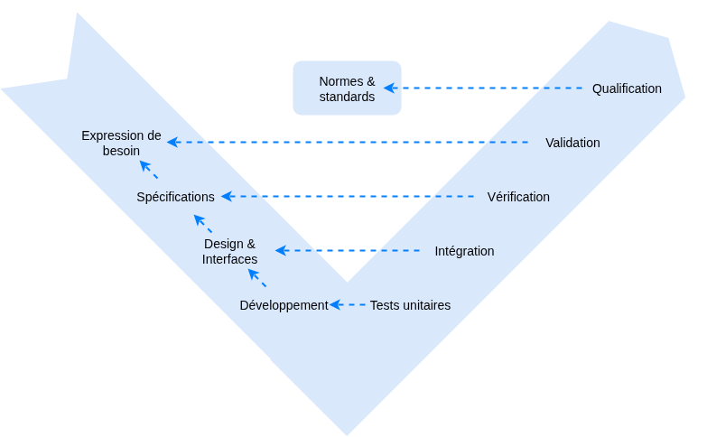
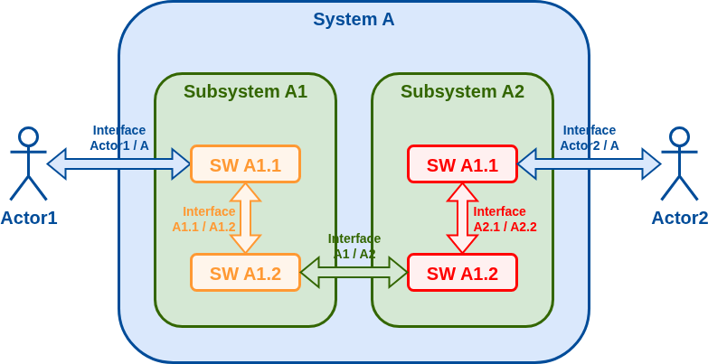
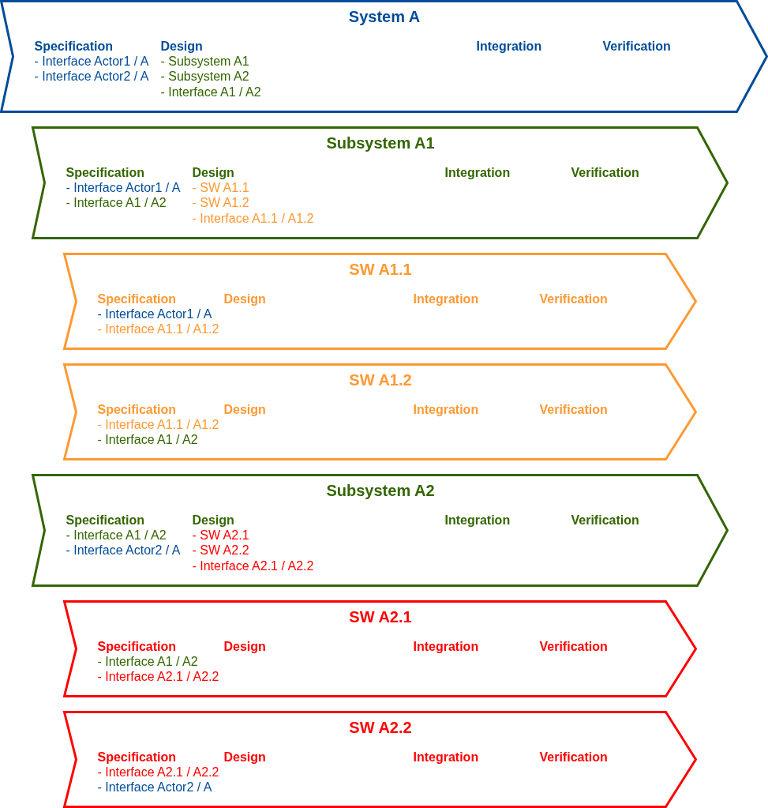
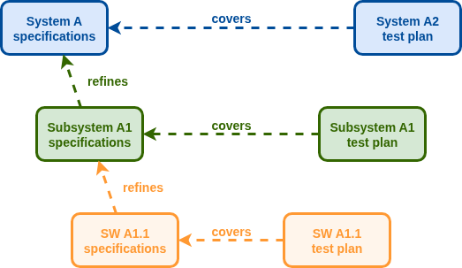
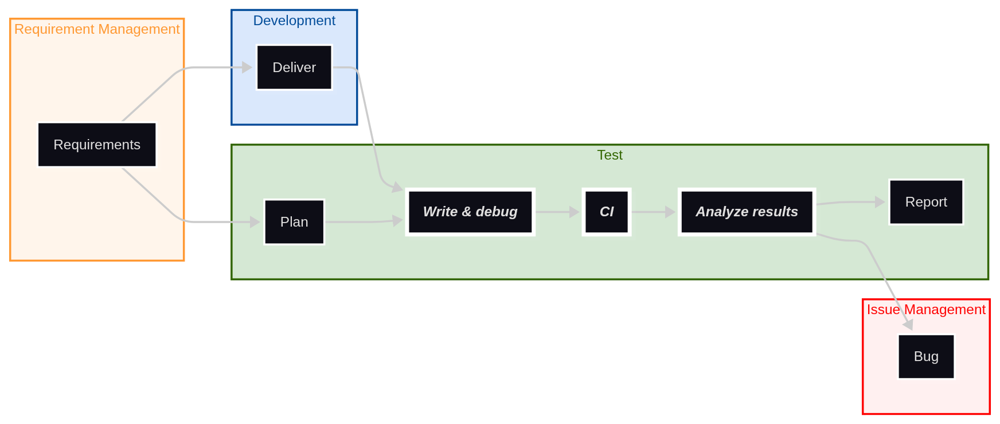

= Tests & Test Management
//:sectnums:  // No section auto-numbering.
:icons: font
// Asciidoctor reveal.js custom CSS (see https://docs.asciidoctor.org/reveal.js-converter/latest/converter/custom-styles/).
:customcss: css/slides.css

Alexis ROYER - https://www.linkedin.com/in/alexis-royer/

2025-2026

[state=topic]
== Sommaire

1. L'activité de test
2. Tests automatiques
3. Management des tests

[state=topic]
== 1. L'activité de test

== Cycle en V et activités de test

=== Normes

ISO 9126:: Critères de qualité d'un logiciel
ISO 12207:: Processus du cycle de vie du logiciel
    * Intégration
    * Vérification
    * Audit
    * Qualification

== Boîte noire / boîte blanche

Vérification exigences => boîte noire

Intégration sous-systèmes & interfaces => boîte blanche

Test unitaires :
boîte blanche

=== DO 178

Cas particulier, norme avionique

Code = sous-système

Conception détaillée = spécification code

Classe / fonction = boîte noire

== Système et sous-systèmes

NOTE: SUT = System / Software Under Test

== Imbrications de cycles en V

== Requirement Management

=== Complétude

// Mémo: Idem raffinements de spécifications,
//       mais on ne fait pas apparaître dans les slides.
Couverture des tests

CAUTION: Difficulté de garantir l'exhaustivité

TIP: Tracer les justifications de la tracabilité établie

=== Tests spécifiants

Quand on n'a pas de spécifications...

=== Changements d'exigences

Versioning des spécifications

Analyses d'impact

Agilité ?
=> _latest_ / "crête de vague"

Issue management

== Issue Management

[IMPORTANT]
====
2ème support important pour les tests

(idem exigences)
====

Défauts du SUT, des exigences, ...

Change management / CCB

== Cycle de vie des tests

_(tests manuels)_

=== Constitution des tests

image::schemas/manual-test.setup.png[]

=== Vérification des corrections

image::schemas/manual-test.fix.png[]

=== Modifications des exigences

image::schemas/manual-test.change.png[]

[.columns]
== Les documents de test

[.column]
--
Plan de tests::
    * Titre et objectifs de test
    * Action et résultats attendus
FCA::
    * Matrice de synthèse
    * Acceptation
--

[.column]
--
Résultats de tests::
    * Version testée
    * Tests du plan
    * Résultats observés (preuves)
    * OK / KO
    * Issues
--

=== FCA

// TODO: Factoriser avec `Test management.adoc`.
|===
| Req id | Req title | Test id | Test title | Test result | Issue

// Memo: `.2+` spans cells one row below.
.2+| REQ_010
.2+| Startup
| TEST_100
| Startup data
| ✅ OK
|

| TEST_110
| Startup sequence
| ✅ OK
|

| REQ_020
| Shutdown
| TEST_200
| Shutdown sequence
| ❌ NOK
| #42: Major: The SW freezes on shutdown.

| ...
|
|
|
|
|
|===

TIP: Indicateur de résultat

== L'esprit du testeur

QA (= Quality Assurance)

_"Dernier rempart"_

// Memo: `^` characters stand for _center_.
[cols="^1,^1"]
|===
| Dev                         | Testeur

| Construit                   | Dissecte
| Intégration bottom-up       | Approche top-down (exigences)
| Fait en sorte que ça marche | Recherche les défauts
| Boîte blanche               | Boîte noire
| Vitesse                     | Rigueur
|===

[state=topic]
== 2. Tests automatiques

[#slide-need-test-automation]
== Besoin d'automatisation

[IMPORTANT]
.Importance d'automatiser les tests
====
Prérequis agilité itérative (time-boxé)

Branche d'intégration stable / livrable

Intégration Continue / non-régressions
====

[TIP]
.Intérêt des tests manuels
====
_Là où l'humain apporte une plus-value_

Intégrations

Validation expression du besoin
====

== Cycle de vie des tests auto

CAUTION: Problèmes connus ?

== Architecture - Compétence développement

Code test ~= Code appli

Langage : JS, Python, Gherkin

TIP: Typage

== Architecture - Framework

* Textes humainement lisibles
* Faciliter les investigations
* Interactions SUT

=== Textes humainement lisibles

Production documentaire plan de test

TIP: Proximité texte / code de test

=== Faciliter les investigations

* Tracebacks
* Assertions
* Logging

** Couleur / indentation
** Stratégie (intégrations)
** Human readable

* Post-mortem

=== Interactions SUT

TIP: Pattern _wait-for / query_

* Aux interfaces du SUT
* Eviter les `sleep()` arbitraires de X secondes
* Préférer une gestion d'événements => _wait-for_
* Wait for what? => _query_ (OO Design)

== Architecture - Performances

TIP: Target 10 minutes max pour les non-régressions

Effet psychologique au détriment de la qualité

== Architecture - Stabilité

TIP: Refuser les instabilités

* Perte de temps au quotidien
* Risque qualité

Analyses post-mortem / collecter les traces

== Architecture - Problèmes connus

TIP: Statut auto // type de campagne

* Non-régression : OK avec contournement
* Vérification : KO, rapport

== Outils

* Langages de test
* Librairies / outils réseau
* Tests unitaires
* Tests d'API
* Tests fonctionnels
* Tests de performance

=== Langages de test

* Javascript
* Python
* Gherkin

[sidebar]
--
👷🛠️ TP : link:TP%20-%20Cucumber%20Gherkin.md[Cucumber & Gherkin]
--

=== Librairies / outils réseau

* curl
* iperf
* Scapy

[sidebar]
--
👷🛠️ TP : link:TP%20-%20Scapy.adoc[Sérialisation / désérialisation de protocoles propriétaires avec Scapy]
--

=== Tests unitaires

* JUnit (Java)
* TestNG (Java)
* NUnit (.Net)
* PHPUnit (PHP)
* Mocha (JS)
* PyUnit / unittest (Python)
* PyTest (Python)

=== Tests d'API

* Spring Boot Test
* RestAssured
* SoapUI
* Postman

[sidebar]
--
👷🛠️ TP : link:TP%20-%20Postman%20Newman%20Jest.adoc[Test d'API avec Postman, Newman et Jest]
--

=== Tests fonctionnels

* Selenium
* Cypress
* Appium
* Cucumber

[sidebar]
--
👷🛠️ TP : link:TP%20-%20Selenium.md[Test d'IHM avec Selenium]
--

=== Tests de performance

* JMeter
* LoadRunner
* Gatling
* Locust
* NeoLoad

== Couverture de code

* Représentativité des tests
* Code mort // code défensif
* Attendu contractuel

[state=topic]
== 3. Management des tests

== Jeux de données

CAUTION: Applications web (données datées)

[#slide-test-timing]
[.columns]
== Timing activités de test

[.column]
.Tests avant
--
NOTE: _Test Driven Development_

TIP: Confort devs

CAUTION: Tests à l'aveugle, à reprendre
--

[.column]
.Tests pendant
--
TIP: Timing intéressant

TIP: Devs et tests s'alimentent
--

[.column]
.Tests après
--
CAUTION: Integ. devs sans outils

CAUTION: Détection erreurs tardives
--

[#slide-waterfall-vs-agile]
[.columns]
== Cycle en V // Agilité

// Use `====` syntax for all admonitions in this slide
// to ensure the generation of texts in `

` items,
// in order to make it easier to define css rules by the way.

[.column]
.Cycle en V
--
* Baselines fixes
* Gconf mieux contrôlée

[CAUTION]
====
Analyses d'impact

Réactivité
====

[TIP]
====
Integ. sous-systèmes,
plannings dédiésTIP
====
--

[.column]
.Agilité
--
* Time boxé
* Dev & test ensemble
* Gconf : _latest_ / "crête de vague"

[CAUTION]
====
Gconf,
maîtrise baseline
====

[TIP]
====
Application logicielle simple
====
--

== Planification constitution des tests

Dans quel ordre constituer les tests ?

Cycle en V ? Méthodes agiles ?

TIP: Dépendance stratégie d'intégration

== Exhaustivité // gestion de risque

Tout tester ?

[TIP]
.Gestion de risques
====
ROI // non qualité
====

=== Gestion de risques

TU seuls ?

Tests manuels // tests auto ?

[TIP]
.Cône de test
====
Eviter les tests redondants
====

[state=topic]
== Annexes

=== Ressources

Images :

* https://www.pexels.com/fr-fr/
* https://fr.freepik.com/
* https://pixabay.com/fr/
* https://dashboardicons.com/ (logos)
* https://www.logo.wine/ (logos)
