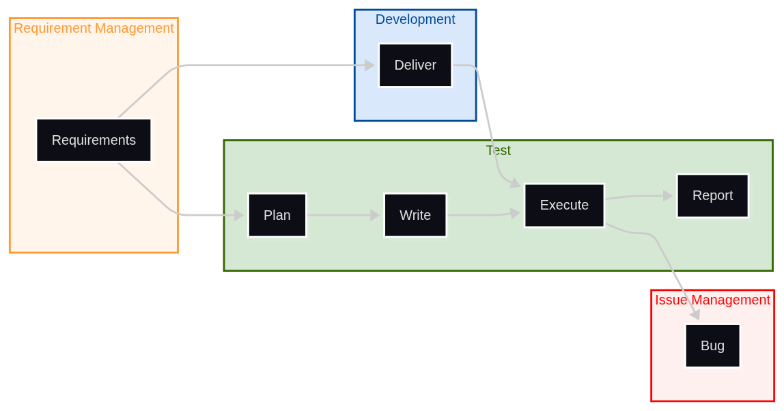

= Tests & Test Management
//:sectnums:  // No section auto-numbering.
:icons: font
// Asciidoctor reveal.js custom CSS (see https://docs.asciidoctor.org/reveal.js-converter/latest/converter/custom-styles/).
:customcss: css/slides.css

image::images/geralt-test-4092025_1920_cropped.jpg[role=banner]

Alexis ROYER - https://www.linkedin.com/in/alexis-royer/

2025-2026

[state=topic]
== Sommaire

1. L'activité de test
2. Tests manuels
3. Tests automatiques
4. Management des tests

[state=topic]
== 1. L'activité de test

== Cycle en V et activités de test

image::schemas/waterfall-test-activities.drawio.png[]

=== Normes

ISO 9126:: Critères de qualité d'un logiciel
ISO 12207:: Processus du cycle de vie du logiciel
    * Intégration
    * Vérification
    * Audit
    * Qualification

== Boîte noire / boîte blanche

Vérification exigences => boîte noire

Intégration sous-systèmes & interfaces => boîte blanche

Test unitaires :
boîte blanche

=== DO 178

Cas particulier, norme avionique

Code = sous-système

Conception détaillée = spécification code

Classe / fonction = boîte noire

== Système et sous-systèmes

image::schemas/system-breakdown.drawio.png[]

NOTE: SUT = System / Software Under Test

[#slide-system-breakdown-waterfall-tiling]
== Tuilage de cycles en V

image::schemas/system-breakdown-activities.drawio.png[]

== Requirement Management

image::schemas/system-breakdown-reqmgt.drawio.png[]

=== Complétude

// Mémo: Idem raffinements de spécifications,
//       mais on ne fait pas apparaître dans les slides.
Couverture des tests

CAUTION: Difficulté de garantir l'exhaustivité

TIP: Tracer les justifications de la tracabilité établie

=== Tests spécifiants

Quand on n'a pas de spécifications...

=== Changements d'exigences

Versioning des spécifications

Analyses d'impact

Agilité ?
=> _latest_ / "crête de vague"

Issue management

== Issue Management

IMPORTANT: 2ème support important pour les tests
           (idem exigences)

Change management / CCB

Défauts du SUT (explication des KO)

TIP: Known issues & tests auto

[#slide-test-docs.columns]
== Les documents de test

[.column]
--
Plan de tests::
    * Titre et objectifs de test
    * Action et résultats attendus
FCA::
    * Matrice de synthèse
    * Support => acceptation
--

[.column]
--
Résultats de tests::
    * Version testée
    * Tests du plan
    * Résultats observés (preuves)
    * OK / KO
    * Issues
--

=== FCA

|===
| Req id | Req title | Test id | Test title | Test result | Issue

// Memo: `.2+` spans cells one row below.
.2+| REQ_010
.2+| Startup
| TEST_100
| Startup data
| ✅ OK
|

| TEST_110
| Startup sequence
| ✅ OK
|

| REQ_020
| Shutdown
| TEST_200
| Shutdown sequence
| ❌ NOK
| #42: Major: The SW freezes on shutdown.

| ...
|
|
|
|
|
|===

TIP: Indicateur de résultat

== L'esprit du testeur

QA (= Quality Assurance)

_"Dernier rempart"_

// Memo: `^` characters stand for _center_.
[cols="^1,^1"]
|===
| Dev                         | Testeur

| Construit                   | Dissecte
| Intégration bottom-up       | Approche top-down (exigences)
| Fait en sorte que ça marche | Recherche les défauts
| Boîte blanche               | Boîte noire
| Vitesse                     | Rigueur
|===

[state=topic]
== 2. Tests manuels

== Intérêt des tests manuels

Tests auto privilégiés +
_méthodes agiles, intégration continue_

TIP: Là où l'humain apporte une plus-value +
Validation expression du besoin

== Activité initiale

[#flow-manual-test-start]

// Does not work in revealjs mode.
//<<flow-auto-test-start, Tests auto>>

== Vérification des corrections

image::schemas/manual-test.fix.png[]

== Changements de périmètre

image::schemas/manual-test.change.png[]

[state=topic]
== 3. Tests automatiques

=== Besoin d'automatisation

Prérequis agilité itérative (time-boxé)

Branche d'intégration stable / livrable

Intégration Continue / non-régressions

=== Activité

[#flow-auto-test-start]
image::schemas/auto-test.start.png[]

// Does not work in revealjs mode.
//<<flow-manual-test-start, Tests manuels>>

CAUTION: Known issues?

=== Architecture

TODO

=== Outils

TODO

=== Couverture de code

TODO

[state=topic]
== 4. Management des tests

=== Jeux de données

TODO

=== Timing activités de test

TODO

=== Cycle en V v/s Agilité

TODO

=== Priorisation des tests

TODO

=== Exhaustivité v/s gestion de risque

TODO

[state=topic]
== Annexes

=== Ressources

TODO
