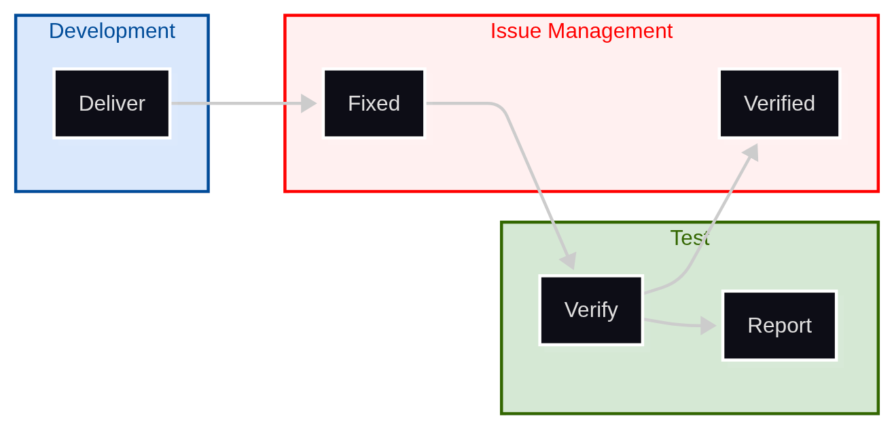
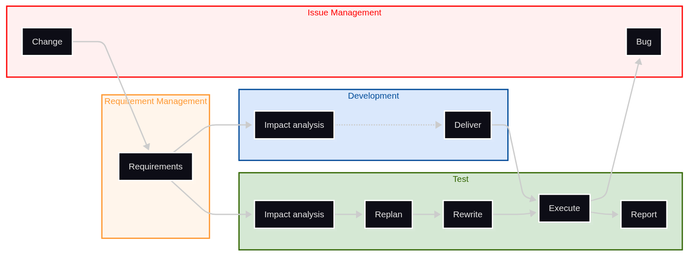

= Tests & Test Management
:doctype: article
// Enable section auto-numbering (see https://docs.asciidoctor.org/asciidoc/latest/sections/numbers/#turn-on-section-numbers).
:sectnums:
// Generate TOC after the preamble (see https://docs.asciidoctor.org/asciidoc/latest/toc/position/#beneath-preamble).
:toc: preamble
// TOC depths (see https://docs.asciidoctor.org/asciidoc/latest/toc/levels/).
// Use 5 (maximum value accepted).
:toclevels: 5
// TOC title (see https://docs.asciidoctor.org/asciidoc/latest/toc/title/).
:toc-title: Sommaire
// Makes admonitions display nicely (see https://docs.asciidoctor.org/asciidoc/latest/blocks/admonitions/#enable-admonition-icons).
:icons: font
// Specific icon configuration for GitHub (inspired from https://raw.githubusercontent.com/tkfu/asciidoctor-github-include/refs/heads/master/README.adoc).
ifdef::env-github[]
:caution-caption: :fire:
:important-caption: :exclamation:
:note-caption: :paperclip:
:tip-caption: :bulb:
:warning-caption: :warning:
endif::[]

// Preamble.

image::images/geralt-test-4092025_1920_cropped.jpg[align="center"]

Alexis ROYER - https://www.linkedin.com/in/alexis-royer/

2025-2026

---

Ce document constitue un cours sur les activités de test,
pour des applications logicielles ou des systèmes.

---

Source : https://github.com/alxroyer/edu-test-management

---

Cours mis à disposition sous licence Creative Common.

Voir xref:appendix-license[xrefstyle=full].

// Footnote declarations (see https://docs.asciidoctor.org/asciidoc/latest/macros/footnote/#externalizing-a-footnote).

// No footnotes.

== L'activité de test

Ce premier chapitre est dédié à la description de l'activité de test.

[#section-waterfall-view]
=== Cycle en V et activités de test

Le schéma du cycle en V
constitue un bon support
pour illustrer les différentes activités de test.

[#figure-waterfall-test-activities]
.Cycle en V et activités de test
image::schemas/waterfall-test-activities.drawio.png[]

Dans un développement linéaire tel que le symbolise le cycle en V,
la première partie du V descend de l'expression de besoin jusqu'à la réalisation :

Expression de besoin::
Le client exprime son besoin,
ou s'il ne l'exprime pas directement,
on l'interviewe pour cerner l'objectif du projet.

Spécifications::
Raffinement de l'expression de besoin sous forme d'exigences.
+
Les exigences décrivent un contrat technique de fonctionnement _boîte noire_
du système ou du logiciel à réaliser.

Conception / design & interfaces::
Conception du système ou logiciel à réaliser.
+
Celle-ci passe généralement par l'identification de sous-systèmes,
et d'interfaces interconnectant ces sous-systèmes.
+
Comme on parle à ce stade du fonctionnement interne du système ou du logiciel,
on utilse le terme de _boîte blanche_.

Développement::
Réalisation des sous-systèmes identifiés
au titre de la conception à l'étape précédente.
+
[NOTE]
====
Dans le cas de systèmes complexes,
un sous-système peut faire l'objet d'une subdivision en sous-sous-systèmes.

Cf. xref:section-subsystems[xrefstyle=full].
====

La deuxième partie du V remonte ensuite
avec des activités de test en face de chacune des opérations
de spécification, design et développement décrites précédemment.

Test unitaires::
Tests réalisés aux bornes d'un sous-système
issu des activités de développement.

Intégration::
Les activités d'intégration consistent à faire fonctionner ensemble
les différents sous-systèmes.
+
Comme ces sous-systèmes communiquent au moyen des interfaces
identifiées en phase de conception,
on associe les activités d'intégration au test des interfaces.

Vérification::
Une fois les sous-systèmes assemblés,
l'objet de la vérification est de contrôler
que les exigences des spécifications sont satisfaites
par le système ou le logiciel développé.

Validation::
Les activités de validation consistent à vérifier
que l'expression du besoin client est bien satisfaite.

Qualification::
Enfin, les activités de qualification
consistent à vérifier la conformité à des normes et standards.

=== Périmètres de test / SUT

Lorsqu'on mène une activité de test,
il est important de maîtriser le périmètre de ce que l'on teste.

On parle de SUT pour _System_ ou _Software Under Test_
(cf. xref:appendix-glossary[xrefstyle=full]).

==== Tests boîte noire / boîte blanche

Une des premières distinctions utiles
est la différence entre _boîte noire_ et _boîte blanche_.

Boîte noire::
Test du SUT sans connaissance de sa conception.
+
On se borne à utiliser les moyens disponibles pour un utilisateur normal,
généralement les interfaces externes du SUT.
+
Objet des tests de vérification des exigences notamment.

Boîte blanche::
Test du SUT en connaissance de sa conception.
+
Objet des tests unitaires ou test d'intégration notamment.
+
Parfois requis pour des injections de fautes,
notamment dans le cadre des tests des fonctions de sécurité.

[#section-subsystems]
==== Décomposition en sous-systèmes

Dans le cas de systèmes complexes,
on peut être amené à subdiviser des sous-systèmes en sous-sous-systèmes,
et ainsi de suite.

[#figure-system-breakdown]
.Systèmes complexes : décomposition en sous-systèmes à plusieurs niveaux
image::schemas/system-breakdown.drawio.png[]

Chaque système et sous-système est généralement pris en charge par une équipe dédiée.
Chaque équipe considère donc un périmètre de SUT différent,
la boîte blanche du SUT de niveau N
constituant la boîte noire des SUT de niveau N-1.

Sur la branche descendante du cycle en V,
les activités de spécification et de conception se tuilent,
du système le plus large jusqu'au sous-système le plus unitaire.

[#figure-system-breakdown-activities]
.Systèmes complexes : imbrication des cycles en V
image::schemas/system-breakdown-activities.drawio.png[]

De la même manière, sur la branche remontante du cycle en V,
les activités de tests se tuilent en sens inverse,
du sous-système le plus unitaire jusqu'au système le plus large.

On peut ainsi considérer que
les activités de vérification du sous-système de niveau N-1
font office de tests unitaires pour le système du niveau N.

Sur l'exemple des deux figures précédentes :

* Phase descendante du cycle en V :

** L'équipe en charge du système `A` (en bleu),
   lors de ses activités de design (boîte blanche du système `A`),
   identifie deux sous-systèmes `A1` et `A2`,
   avec une interface interne `A1 / A2`.
** L'équipe en charge du sous-système `A1` (en vert)
   lors de ses activités de spécification,
   identifie des exigences pour le sous-système `A1`
   (boîte noire du sous-système `A1`).

* Phase remontante du cycle en V :

** L'équipe en charge du sous-système `A1` (en vert)
   réalise ses activités de vérification de ses exigences
   (boîte noire du sous-système `A1`),
   puis livre le sous-système `A1` à l'équipe du système `A`.
** L'équipe en charge du système `A` (en bleu)
   reçoit la livraison des sous-systèmes `A1` et `A2`,
   et réalise l'intégration de l'interface `A1 / A2`
   (boîte blanche du système `A`).

[TIP]
====
Cf. xref:section-subsystems-test-redundancy[xrefstyle=full]
pour une discussion sur la redondance possible des tests
dans ces cas de décomposition en sous-systèmes.
====

[#section-requirement-management]
=== Gestion des exigences _(requirement management)_

==== Exigences formelles

Comme évoqué en xref:section-waterfall-view[xrefstyle=full],
les exigences constituent généralement le premier entrant des activités de test.

Dès lors, l'activité de test intègre pleinement la gestion des exigences
_(requirement management)_ :

* Sur la phase descendante du cycle en V,
  entre les différents niveaux de sous-système,
  les exigences se tracent entre elles dans une logique de raffinement.
* Sous l'angle des activités de test,
  chaque test permet de couvrir tout ou partie des exigences vérifiées.

[#figure-requirement-management]
.Gestion des exigences _(requirement management)_
image::schemas/system-breakdown-reqmgt.drawio.png[]

[NOTE]
====
On a pratique de considérer la qualité d'une exigence selon l'acronyme _SMART_.

A noter que, dans l'acronyme _SMART_, la lettre _T_ signifie _Testable_.

Cette observation illustre l'importance des tests
dans le processus de gestion des exigences.
====

*Complétude de test*

A un moment, se pose la question de la complétude des tests
en regard des exigences vérifiées :
les tests proposés couvrant une exigence donnée
couvrent-ils tous les aspects de l'exigence ?

Un point souvent difficile à assurer, et coûteux à vérifier

[#tip-track-completeness-justification]
[TIP]
.Tracer les justifications de complétude des tests
====
Au moment d'identifier les tests nécessaires et suffisants
permettant de couvrir les exigences,
il peut être utile de tracer le raisonnement
ayant permis de construire cette couverture.

C'est une information fugace qui se perd sinon,
et est très difficile à retrouver a posteriori.

Ainsi, il est utile de capitaliser cette information,
pour en faciliter la maintenance avant tout.

Cela sert au passage de justification
permettant d'assurer la maîtrise de la complétude des tests.
====

*Modification des exigences*

Le fait que les exigences puissent évoluer dans le temps
implique de maîtriser la version des exigences applicables à un moment donné.

La version des exigences peut être portée
par la version du document de spécification.

On peut également retrouver une information de version plus fine
directement attachée à chaque exigence,
ce qui permet de mieux suivre quelle exigence a bougé
entre deux versions des mêmes spécifications.

Cf. xref:section-lifecycle-req-change[xrefstyle=full]
pour une discussion sur le cycle de vie des tests
en cas de modification des exigences.

==== Test spécifiants

Il existe également des projets où on ne rédige pas d'exigences formelles.

En ce cas, les tests vont tenter de couvrir une expression de besoin,
soit sous la forme d'un document dédié
(comme évoqué en xref:section-waterfall-view[xrefstyle=full]),
soit sous la forme de _User Stories_ (cas des développement en agilité).

Dès lors, on a coutume de dire que les tests sont *spéficiants*.
En effet, en l'absence d'exigences formelles,
les tests constituent le support le plus précis
décrivant les attendus du SUT.

[#section-issue-management]
=== Gestion des tickets _(issue management)_

Le deuxième élément d'entrée important pour une activité de test
est la gestion des tickets _(issue management)_.

Ces tickets permettent de tracer les *défauts* :

* On pense en premier lieu aux problèmes constatés dans le fonctionnement du SUT.
  Ces tickets d'anomalies, permettent entre autre :

** d'expliquer la raison des tests KO (cf. xref:section-fca[xrefstyle=full]),
** de suivre l'état des corrections dans le SUT,
   et de faire la vérification de ces corrections
   (cf. xref:section-lifecycle-fix-verification[xrefstyle=full]).

* Ils permettent également de tracer les incohérences ou les manques dans la documentation,
  notamment dans les spécifications d'entrée !

* Et pourquoi pas tracer également les défauts des tests ?
  Cela peut se produire, par exemple,
  lorsqu'on sait qu'on a un défaut dans nos tests,
  mais qu'on n'a pas encore le temps ou les moyens de rectifier la situation.

Ces tickets permettent également de tracer le *travail planifié*.
On parlera notamment en développement agile de _User Stories_, de _Technical Stories_, ...

Enfin, ces tickets permettent de tracer les *modifications d'exigences*
(cf. xref:section-lifecycle-req-change[xrefstyle=full]).

[NOTE]
====
Les équipes de test participent régulièrement
aux réunions de *CCB* _(Change Control Board)_,
réunions qui suivent et pilotent la prise en compte
des corrections et modifications à apporter au SUT.
====

=== Cycle de vie des tests

La description du cycle de vie des tests ci-après
correspond en premier lieu à un contexte de tests manuels.

Ce cycle de vie évolue quelque peu à la marge en tests automatiques
(cf. xref:section-auto-lifecycle[xrefstyle=full]).

[#section-lifecycle-test-setup]
==== Constitution des tests

Le schéma ci-après décrit la constitution initiale des tests.

[#figure-lifecycle-test-setup]
.Constitution des tests
image::schemas/lifecycle-manual-setup.png[]

Comme indiqué en xref:section-requirement-management[xrefstyle=full],
les *exigences* constituent un élément d'entrée pour les tests,
mais également pour les développements naturellement.

Une des premières activités à mener pour la constitution des tests
consiste à préparer le *plan* de test préliminaire.
On entend à ce niveau l'identification de tests,
avec certaines informations minimales comme un titre et un objectif de test,
et traçant les exigences à vérifier.

L'établissement du plan de test donne lieu à une analyse approfondie des exigences,
pour en assurer une bonne couverture par les tests
(question de la complétude des tests,
discutée en xref:section-requirement-management[xrefstyle=full]).
C'est également un moment privilégié pour challenger les spécifications d'entrée
(cf. xref:section-issue-management[xrefstyle=full]).

Vient ensuite le temps de l'*écriture* des tests.
Chacun des tests, avec titre et objectif,
va être détaillé en une série d'actions et de résultats attendus.
Cette étape aboutit à la constitution d'un plan de test détaillé
(cf. xref:section-test-plan-document[xrefstyle=full]).

Une fois le plan de test détaillé constitué,
et un SUT disponible à l'issue des développements,
on peut dérouler l'*exécution* des tests.

A l'issue de l'exécution d'une campagne de test :

* On enregistre les défauts du SUT sous forme de *tickets d'anomalies*
  (cf. xref:section-issue-management[xrefstyle=full]).
* On produit un *rapport* pour la version de SUT testée,
  consignant les résultats de chaque test,
  et pour chaque test KO la référence du/des ticket(s) d'anomalie décrivant le problème
  (cf. xref:section-test-report-document[xrefstyle=full]).

[#section-lifecycle-fix-verification]
==== Vérification des corrections

Une fois les défauts du SUT corrigés,
l'équipe de test reprend la main pour vérifier que le problème a bien été corrigé.

[#figure-lifecycle-fix-verification]
.Vérification des corrections

Dans le cas nominal,
dans l'outil de gestion des tickets (cf. xref:section-issue-management[xrefstyle=full]),
le rapport d'anomalie passe généralement d'un état _corrigé_ à un état _vérifié_,
et pourra ensuite être _clos_.

Si la vérification de la correction échoue,
il repassera de l'état _corrigé_ à _réouvert_,
et l'équipe de développement devra reprendre le travail.

Cette activité de vérification des corrections
ne sert pas uniquement à contrôler la qualité du travail de l'équipe de développement,
mais également à mettre à jour l'état des tests pour le prochain rapport de test
(cf. xref:section-test-report-document[xrefstyle=full]).

Cela sert également à vérifier que le problème corrigé
n'en cachait pas éventuellement un autre dans la suite du scénario de test,
auquel cas un nouveau rapport d'anomalie sera généré
(cf. xref:section-issue-management[xrefstyle=full]).

[#section-lifecycle-req-change]
==== Modifications des exigences

En cas de modification des exigences,
le schéma suivant illustre la complexité du processus,
avec la mise en jeu des différentes activités :

* gestion des tickets (cf. xref:section-issue-management[xrefstyle=full]),
* gestion des exigences (cf. xref:section-requirement-management[xrefstyle=full])),
* activités de développement,
* activités de test.

[#figure-lifecycle-req-change]
.Modification des exigences

Ce qui permet de tout déclencher de manière cohérente,
et de tracer la raison des modifications
dans les spécifications, dans les développement et dans les tests,
c'est l'existence d'un ticket d'évolution
(cf. xref:section-issue-management[xrefstyle=full]).

Ce ticket est traité en premier lieu par les équipes en charge des spécifications.

Les modifications d'exigences font ensuite l'objet d'*analyses d'impact*,
pour les équipes de développement d'une part,
et pour les équipes de test d'autre part.

[TIP]
. Stratégie _latest_ ou "crête de vague"
====
De sorte à fluidifier ces analyses d'impact,
on pourra adopter une stratégie en _latest_ (ou "crête de vague").

L'idée est de faire avancer les spécifications, code et test en même temps
pour chaque ticket d'évolution (cf. xref:section-issue-management[xrefstyle=full])).

A noter que, pour des raisons de gestion du planning,
cette stratégie n'est possible que sur sur un développement de petite taille,
ou un développement de sous-système final
dans un projet complexe (cf. xref:section-subsystems[xrefstyle=full]),
généralement un développement logiciel.

Une telle stratégie ne réduit vraiment le coût des analyses d'impact,
mais permet essentiellement d'alléger l'effort de versioning des exigences
(cf. xref:section-requirement-management[xrefstyle=full]).
====

Côté tests,
les modifications d'exigences peuvent impacter en premier lieu
l'identification des tests du *plan* de test
(i.e. plan de test préliminaire).

En résultat, on identifie donc potentiellement une série de tests ajoutés
à *écrire* entièrement (i.e. plan de test détaillé).
D'autres tests restent avec leur titre et objectif inchangés,
mais la traçabilité ayant évolué,
ou les exigences tracées ayant été modifiées,
leurs actions et résultats attendus doivent être ajustés.

Enfin, une fois le plan de test détaillé ajusté,
et un SUT mis à jour par l'équipe de développement,
on peut redérouler l'*exécution* des tests
avec les mêmes sorties qu'en xref:section-lifecycle-test-setup[xrefstyle=full].

[CAUTION]
.Coût des modifications d'exigences
====
Les modifications d'exigences s'avèrent souvent coûteuses
pour les activités de test,
en raison notamment de la complétude des tests qu'il faut continuer d'assurer.

Cela passe en premier lieu par la modification de la traçabilité déjà établie.
Pour ce faire, penser à xref:tip-track-completeness-justification[]
(cf. xref:section-requirement-management[xrefstyle=full]).

Mais la question de la complétude des tests se cache aussi souvent
dans le détail des actions et résultats attendus au sein des tests.

C'est donc une vigilance accrue qu'il faut maintenir
sur toute la chaîne de reprise des travaux.
====

[#section-test-documents]
=== Documents

[#section-test-plan-document]
==== Plan de test

Le plan de test est un document qui identifie des tests à jouer.

Comme introduit en xref:section-lifecycle-test-setup[xrefstyle=full],
il est usuel de constituer le plan de test en deux étapes :

* un *plan de test préliminaire* dans un premier temps,
* puis un *plan de test détaillé*.

Dans le plan de test préliminaire, chaque test vient généralement avec :

* un *identifiant* :
  indispensable pour la gestion des exigences
  (cf. xref:section-requirement-management[xrefstyle=full]),
  utile dans tous les cas pour manipuler les tests,
* un *titre court* :
  utile pour une présentation rapide dans des tableaux,
* un *objectif* :
  car le titre court est souvent trop court pour décrire l'intention du test,
* une *traçabilité* :
  si on s'inscrit dans un cadre de gestion des exigences
  (cf. xref:section-requirement-management[xrefstyle=full]),
  chaque test trace une ou des exigences qu'il vérifie, tout ou partie.

Dans le plan de test détaillé,
chaque test est ensuite rédigé
sous la forme d'une succession d'*actions* et de *résultats attendus*,
tel qu'un opérateur manuel pourrait suivre une procédure
pour constater le bon fonctionnement ou non du SUT.

[#section-test-report-document]
==== Rapport de test

Le rapport de test est un document qui consigne les résultats de test
pour chaque test identifié dans le plan de test.

Si le plan de test décrit les tests en intention,
la rapport de test consigne les résultats
pour une campagne de test sur une *version de SUT donnée*.
C'est donc une des premières informations consignée dans le rapport.

Il reprend ensuite la structure générale du plan de test,
en rajoutant pour chaque étape de test une information de *résultats observés*,
ces résultats observés étant à mettre en regard des résultats attendus :

* En cas de succès,
  on peut consigner des *preuves de test*,
  attestant le fait que l'étape de test a bien été déroulée avec succès.
* En cas de défaut du SUT,
  on consigne en revanche le problème,
  notamment avec une référence de *rapport d'anomalie*
  (cf. xref:section-issue-management[xrefstyle=full]).

Comme on peut rapidement atteindre des centaines de tests dans un rapport de test,
on a coutume également de présenter dans ce document un *tableau de synthèse*
avec un test pour chaque ligne,
et en colonnes :

* l'identifiant du test,
* le titre court du test,
* le statut du test : OK ou KO,
* la référence du rapport d'anomalie en cas de KO.

[#section-fca]
==== FCA _(Functional Configuration Audit)_

Un FCA consiste principalement en un tableau de synthèse des résultats de test
par exigence d'entrée.

// TODO:
//   Factoriser avec `Test management - slides.adoc`.
//   Problème : la directive `include::` est bridée dans le rendu AsciiDoc par GitHub.
[#table-fca]
.Tableau de synthèse FCA
|===
| Req id | Req title | Test id | Test title | Test result | Issue

// Memo: `.2+` spans cells one row below.
.2+| REQ_010
.2+| Startup
| TEST_100
| Startup data
| ✅ OK
|

| TEST_110
| Startup sequence
| ✅ OK
|

| REQ_020
| Shutdown
| TEST_200
| Shutdown sequence
| ❌ KO
| #42: Major: The SW freezes on shutdown.

| ...
|
|
|
|
|
|===

Ce genre de tableau permet de visualiser les bugs résiduels,
avec leur criticité, et l'impact sur les exigences mises en défaut.

En ce sens, il constitue un support permettant de se prononcer
sur une acceptation du niveau de qualité du SUT testé :
GO / NO GO pour livraison.

[TIP]
.Vue indicateur de résultat
====
Cette vue des exigences tel que le propose un tableau de FCA
permet de construire un indicateur de résultat.

Les indicateurs de résultat,
par opposition aux indicateurs d'avancement (exemple : nombre de ligne de code)
permettent de juger de l'avancement du projet par rapport à une cible finale fixe.

En effet, sur la base d'un objectif de couverture des exigences d'entrée,
dont le nombre est normalement connu en début de projet est stable jusqu'à la fin,
on peut compter celles qui sont effectivement OK,
et donc un pourcentage d'avancement fiable.

D'expérience, cet indicateur reste un indicateur pessimiste,
car il est souvent difficile d'atteinde un état OK pour chaque exigence,
en raison du nombre de tests pouvant couvrir une même exigence.
Il suffit d'avoir un bug mineur sur l'une de ces exigences
pour faire tomber l'exigence en KO.
En en cas de régressions, l'indicateur peut se dégrader rapidement.
====

=== L'esprit du testeur

Enfin, pour clôturer ce chapitre sur les activités de test,
il est opportun de dire un mot sur le profil type du testeur.

Dans les offres d'emploi,
les métiers du test sont souvent intitulés sous le terme QA
pour _Quality Assurance_.

En effet, c'est bien la posture qu'on attend du testeur :
se faire le dernier rempart pour assurer le niveau de qualité du SUT.

C'est un véritable état d'esprit qui s'oppose en de nombreux points
aux qualités usuelles des développeurs :

[cols="1,1"]
|===
| Développeur | Testeur

| Le développeur construit le logiciel.
| Le testeur dissecte les exigences sous tous ses aspects,
  pour ne rien laisser passer par rapport au contrat du SUT.

| Le développeur intégre les couches logicielles du bas vers le haut.
| Le testeur adopte une démarche descendante, à partir des exigences.

| Le développeur raisonne d'abord en conception, boîte blanche.
| Le testeur raisonne d'abord en exigences, boîte noire.

| L'objectif du développeur est de montrer que le SUT marche a minima.
| L'objectif du testeur est de rechercher les défauts.

| Une des qualités premières du développeur est d'aller vite.
| On apprécie le testeur pour sa rigueur.
|===

Le métier du testeur est finalement assez complet
dans le sens où il requiert la capacité à embrasser de nombreuses activités connexes
telles que la gestion des exigences ou la gestion de configuration.
Il requiert également la capacité à comprendre le besoin client
pour s'en faire le porte parole dans les activités de développement.

Par ailleurs, si les tests sont automatisés,
le testeur doit en plus avoir des aptitudes de développeur,
car il doit également mener une activité de développement pour les tests
(cf. xref:section-auto-skills[xrefstyle=full]).

La transition est toute trouvée avec le chapitre suivant.

== Tests automatiques

=== Besoin d'automatiser les tests

Une grande place est accordée aujourd'hui aux tests automatisés
dans les *développements logiciels*.

C'est en partie lié aux méthodes agiles
qui définissent l'automatisation des tests comme un prérequis indispensable
au bon fonctionnement de la méthode.

Un des principes de base
consiste à assurer une branche d'intégration toujours stable et livrable.

Pour ce faire, le déroulement de tests de non-régression de manière automatique,
idéalement lancés automatiquement par la chaîne de CI _(Continuous Integration)_,
est un incontournable.

On constate également la possibilité d'automatiser les *tests système*.
Cela requiert généralement la mise en oeuvre de moyens matériels spécifiques :
routeurs, sondes, câbles, drivers dédiés, ...
et une vigilance accrue aux problématiques de stabilité des tests
(cf. xref:section-auto-stability-performance[xrefstyle=full]).

[#section-auto-lifecycle]
=== Cycle de vie des tests auto

Le schéma ci-après ajuste le cycle de vie présenté avant
pour les constitution tests manuels
(cf. xref:figure-lifecycle-test-setup[xrefstyle=full]) :

[#figure-lifecycle-test-auto]
.Constitution des tests
image::schemas/lifecycle-auto-setup.png[]

On peut observer deux différences principales sur ce schéma
par rapport à la version pour les tests manuels.

Premièrement,
comme indiqué en xref:section-timing-test-setup[],
en matière de tests auto,
il est compliqué d'écrire les tests avant de disposer du SUT.
C'est pourquoi, contrairement aux tests manuels,
on préfèrera disposer du SUT dès cette phase,
pour pouvoir écrire et débugguer les tests auto en même temps.

La deuxième différence majeure réside dans l'exécution des tests.
En tests manuels, l'opérateur humain effectue naturellement
l'exécution et l'analyse des résultats de façon simultanée.
En tests auto, on peut distinguer l'exécution des tests, généralement dans la CI,
et l'analyse (ou dépouillement) des résultats dans un second temps.

Ce deuxième point est une différence impactante,
car elle véhicule son lot de difficultés :

* besoin de faciliter les investigations en post-mortem
  (cf. xref:section-auto-facilitate-investigations[xrefstyle=full]),
* incertitudes en cas d'instabilité des tests
  (cf. xref:section-auto-stability-performance[xrefstyle=full]),
* problématique de gestion des problèmes connus
  (cf. xref:section-auto-known-issues[xrefstyle=full]),
* ...

[#section-auto-skills]
=== Tests auto & compétences d'architecture logicielle

Le code de tests auto couvrant les mêmes exigences que le SUT,
le volume de code de tests auto s'apparente au volume de code d'un SUT
(dans le cas d'un développement logiciel).

Les tests auto tirent ainsi des problématiques similaires
à celles d'un développement logiciel :

* maintenabilité,
* performances,
* stabilité,
* ...

Ce sont des problématiques complexes
qui requièrent des compétences d'architecture logicielle.

Il s'agit là d'un besoin de staffing à ne pas sous-estimer.
En effet, lorsque les bons profils ne sont pas mobilisés en temps et en heure,
cela peut conduire à des surcoûts conséquents sur les activités de test,
voire des échecs.

[#section-auto-architecture]
=== Principes d'architecture

Avant de choisir un framework du marché (cf. xref:section-auto-test-frameworks[xrefstyle=full]),
cette section liste quelques principes d'architecture à considérer au préalable.

[NOTE]
====
Les frameworks de test n'apportent pas toujours une réponse native
à l'ensemble des principes d'architecture énoncés dans ce chapitre.
====

[#test-auto-texts]
==== Gestion du rédactionnel

Cette question s'impose lorsqu'on doit produire
des plans de test et rapports de tests en bonne et due forme,
et qu'on s'inscrit dans une stratégie de tests automatiques à la fois.

Le fait d'avoir à produire des documents et du code de test cohérents
amène la question de savoir comment maintenir cette cohérence dans le temps.

[TIP]
.Proximité textes / code de test
====
Une stratégie qui a fait ses preuves consiste à :

* Rédiger les actions et résultats attendus *dans le code de test*,
  au moyen d'une structuration du code permettant de positionner le rédactionnel
  au *plus près du code de test* associé :
  idéalement le texte de l'action juste avant le code de test dédié,
  de même pour un résultat attendu.
* Puis *générer* les documents, plans de test et rapports de test,
  à partir du code de test.
  Cela passe généralement par un outillage à mettre en place.
====

D'expérience, même si ce n'est pas un exercice imposé,
le fait de disposer du texte intentionnel en toutes lettres dans le code de test
aide à la relecture du code,
ainsi que dans les logs de test pour les analyses en post-mortem
(cf. xref:section-auto-facilitate-investigations[xrefstyle=full]).

[TIP]
.Outiller l'enregistrement des preuves de test
====
Comme suggéré en xref:section-test-report-document[xrefstyle=full],
dans le code de test associé aux résultats attendus,
et accessoirement aux actions également,
on pourra enregistrer des preuves de test
permettent d'attester a posteriori que le test auto a bien vérifié ce qu'il faut.

Cela constitue également des informations facilement intelligibles,
facilitant l'analyse des logs en post-mortem
(cf. xref:section-auto-facilitate-investigations[xrefstyle=full] encore une fois).
====

[#section-auto-facilitate-investigations]
==== Faciliter les investigations

Comme évoqué en xref:section-auto-lifecycle[],
une des grandes difficultés des tests automatiques
réside dans le fait de dépouiller les résultats après exécution.

Dans ces conditions, pour l'analyse des tests KO,
on parle d'analyses _post-mortem_.

Pour ce faire, la meilleure source d'information reste les logs,
et notamment les logs de test en premier lieu.

Cela passe par différents aspects :

* travailler la lisibilité des logs,
* donner le maximum de contexte en cas d'erreur de test.

===== Travailler la lisibilité des logs

Travailler la lisibilité des logs permet d'en accélérer les analyses.

====== Niveaux de logs

On entend par _niveaux de logs_ la notion de sévérité
au sens de la https://www.rfc-editor.org/info/rfc5424/#appendix-A.3[RFC 5424] (syslog),
classiquement :

* `DEBUG`,
* `INFO`,
* `WARNING`,
* `ERREUR`.

Avoir une bonne utilisation des niveaux de logs
permet de faciliter la lecture des logs,
car l'importance de l'information est ainsi directement indiquée.

Il est pourtant fréquent de constater que ces niveaux de logs
sont utilisés de manière disparate sur un même projet.

C'est souvent révélateur d'un manque de stratégie en début du projet
sur l'usage des différents niveaux de logs.

[CAUTION]
====
En conséquence,
les développeurs de tests auto
risquent d'utiliser des niveaux de logs `WARNING` ou `ERREUR`
pour mieux voir apparaître leurs nouveaux logs dans le flux
pendant l'intégration de leurs tests.

Et il est fréquent qu'ils oublient d'ajuster ces niveaux de logs
avant de livrer le code de test...
====

Dans le domaine du test,
on peut facilement adopter quelques règles
permettant d'assurer une gestion rationnelle des niveaux de logs :

* Réserver la classe `ERREUR` aux erreurs de test
  (et non les erreurs du SUT,
  car on peut légitimement tester des scénarios d'erreur).
* Réserver la classe `WARNING` aux alertes adressées au testeur.
* Utiliser la classe `INFO` pour les événements notables,
  permettant notamment d'analyser les logs en post-mortem :

** Démarrages et arrêts du SUT.
** Messages envoyés au SUT et reçus du SUT.
** Modifications d'états,
   pour les états fonctionnels identifiés au titre des spécifications.
** Modifications de configuration.
** ...

* Sinon utiliser la classe `DEBUG` pour tout le reste.
* Masquage des logs de `DEBUG` par défaut.

[TIP]
.`DEBUG` et classes de logs
====
A ce stade,
selon la complexité fonctionnelle du SUT testé,
et donc du code de test en regard,
l'activation des logs de `DEBUG` risque de générer un volume de logs conséquent.

Il peut donc être utile de prévoir une notion de _classe de log_.
Cette _classe de log_ peut être apparentée à la notion
d'https://www.rfc-editor.org/info/rfc5424/#section-6.2.5[`APP-NAME`]
au sens de la https://www.rfc-editor.org/info/rfc5424/[RFC 5424].

Dès lors, on peut activer les logs de `DEBUG`
pour une sélection de classes de log au besoin.

.Classes de logs
=====
----
STEP#2: Logging with the scenario instance (demo/loggingdemo.py:33:LoggingScenario.step020)
------------------------------------------------
    ACTION: Log messages of different log levels with the scenario itself.
              ERROR    [demo/loggingdemo.py] This is an error!!!
              WARNING  [demo/loggingdemo.py] This is a warning!
              INFO     [demo/loggingdemo.py] This is information.
----

L'exemple ci-dessus présente une classe de test `demo/loggingdemo.py`
pour laquelle les niveaux de log `ERROR`, `WARNING`, `INFO` sont affichés par défaut,
l'affichage des logs de `DEBUG` est désactivé.
=====
====

====== Colorisation des logs

Une fois qu'on s'est doté d'une stratégie définissant l'usage des niveaux de logs,
la suite logique consiste à coloriser les logs en fonction de ces niveaux,
classiquement :

|===
| Niveau de log | Couleur

| `ERREUR` | Rouge
| `WARNING` | Orange
| `INFO` | Blanc
| `DEBUG` | Gris (par exemple)
|===

Cela peut paraître cosmétique à première vue,
mais c'est en réalité une véritable mesure de productivité.
En effet, grâce aux couleurs,
l'oeil va directement à l'information essentielle.
C'est donc un gain de temps précieux.

Pour ce faire, lorsque le flux de logs est destiné à être affiché dans une console,
on peut insérer des caractères de contrôle permettant d'ajouter la couleur.
Ou on pourra utiliser un outil dédié à la visualisation de logs,
avec des configurations permettant d'ajouter cette colorisation.

[#section-log-indentation]
====== Indentation des logs

La capacité à pouvoir indenter les logs
constitue un fort levier d'accélération de la lecture des logs.

[#example-log-indentation]
.Indentation des logs
====
----
STEP#1: Logging with the main logger (demo/loggingdemo.py:24:LoggingScenario.step010)
------------------------------------------------
    ACTION: Log messages of different log levels with the main logger.
              ERROR    This is an error!!!
              WARNING  This is a warning!
              INFO     This is information.
              DEBUG    This is debug.
----
====

L'indentation des logs permet de structurer les informations de manière logique,
permettant de mettre en évidence l'attachement des logs à un contexte donné :

Etapes de test::
Faire apparaître les actions et résultats attendus
sous le texte de l'étape de test correspondante
(cf. xref:example-log-indentation[xref-style=full]).

Actions et résultats attendus::
Faire apparaître les logs d'exécution du code de test
sous le texte d'action ou de résultat attendu correspondant
(cf. xref:example-log-indentation[xref-style=full]).

Fonction produit::
Capacité à utiliser l'indentation pour rattacher des logs
à une fonctionnalité du SUT.

Récursivité::
Utile pour le debugging de fonctions récursives.
Ajouter de l'indentation en entrée de fonction récursive,
et retirer cette indentation à la sortie.
L'identation des logs est alors directement représentative
de l'arborescence des appels de la fonction récursive.

[#section-human-readable-logs]
====== Logging d'informations humainement lisibles

Faire en sorte que les informations soient humainement lisibles
simplifie grandement la lecture des logs de test.

Comme suggéré en xref:test-auto-texts[xrefstyle=full],
le fait de disposer de *textes d'actions*, de *résultats attendus*,
voire de *preuves de test*
dans le code de test automatique
permet de logguer ces informations.

La gestion des *problèmes connus*
(cf. xref:section-auto-known-issues[xrefstyle=full])
permet également d'apporter des informations utiles dans les logs.

Cela contribue à apporter dans les logs
des éléments directement compréhensibles par l'humain
sans besoin d'analyses supplémentaires.

[TIP]
.Rappel : indentation liée au rédactionnel
====
Cela permet même d'en tirer partie avec l'ajout d'indentation associée
(cf. xref:section-log-indentation[xrefstyle=full]).
====

Mais il reste utile de prolonger l'effort sur les valeurs de test
ayant un *sens fonctionnel* :

* valeurs d'états : valeur entière agissant comme un énuméré en C,
* données sérialisées : messages échangés sur les interfaces, données de configuration,
* ...

Afficher l'information en utilisant le vocabulaire fonctionnel
s'avère beaucoup plus efficace que sous la forme de donnée brute.

.Affichage de paquets déformatés avec Scapy
====
Sur réception d'une trame Ethernet reçue sur une interface réseau `eth0`,
on pourrait logguer une trace comme ceci :

[source, python]
----
# Message reception simulation.
buf = bytes.fromhex("ffffffffffff123456abcdef08004500002100010000401176c601020304ffffffff6d242694000d444448656c6c6f")

# Trace display.
logging.info(f"[eth0] Message received: {buf.hex()}")
----

----
INFO [eth0] Message received: ffffffffffff123456abcdef08004500002100010000401176c601020304ffffffff6d242694000d444448656c6c6f
----

En déformattant le message entrant avec Scapy,
on peut facilement proposer un affichage plus compréhensible :

[source, python]
----
from scapy.layers.l2 import Ether

# Message reception simulation.
buf = bytes.fromhex("ffffffffffff123456abcdef08004500002100010000401176c601020304ffffffff6d242694000d444448656c6c6f")

# Trace display:
# 1. Parse `buf` with Scapy.
pkt = Ether(buf)
# 2. Display `repr(pkt)` (memo: the `!r` format specification stands for that).
logging.info(f"[eth0] Message received: {pkt!r}")
----

----
INFO [eth0] Message received: <Ether  dst=ff:ff:ff:ff:ff:ff src=12:34:56:ab:cd:ef type=IPv4 |<IP  frag=0 proto=udp src=1.2.3.4 dst=255.255.255.255 |<UDP  sport=27940 dport=9876 |<Raw  load=b'Hello' |>>>>
----
====

[sidebar]
--
👷🛠️ TP : link:TP%20-%20Scapy.adoc[Sérialisation / désérialisation de protocoles propriétaires avec Scapy]
--

====== Corrélation de logs

Une difficulté lors de l'analyse des logs réside souvent
dans le fait de rechercher les informations en transverse
entre différentes sources de logs :

* log de test,
* log(s) du SUT,
* logs d'outils,
* ...

[NOTE]
====
Le SUT peut potentiellement logguer différents fichiers de logs,
notamment s'il s'agit d'un système complexe, composé de plusieurs sous-systèmes.
====

Une des premières solutions consiste à injecter tous ces logs
dans un *puits de log unique*,
tel un ELK (_Elasticsearch_ + _Logstash_ + _Kibana_).

Merger différents logs dans un même puits de log
peut toutefois présenter quelques difficultés :

* Cela crée un volume de logs énorme, dans laquelle il faut savoir naviguer.
+
Pour ce faire, Kibana propose des fonctions de recherche,
qui nécessitent toutefois l'écriture de filtres qui peuvent s'avérer complexes.

* Quelques problèmes d'ordre entre les logs peuvent arriver
en raison de l'imprécision de la date/heure entre les différents éléments
desquels les logs sont issus.

[TIP]
.Diagrammes de séquence automatiques à partir des logs
====
Pour rendre les choses plus visuelles et plus immédiates,
on pourra chercher à représentaer graphiquement les échanges dans un système complexe
à l'aide d'un diagramme de séquence.

Il semble qu'il n'existe pas de solution évidente permettant cela.

Pour autant, c'est une piste d'accélération sérieuse pour l'analyse des logs.
====

===== Donner le maximum de contexte en cas d'erreur

En cas d'erreur de test,
assurer les mécanismes qui permettent de tracer un maximum d'information
permettant de décrire le contexte dans lequel l'erreur est survenue.

Plus on dispose d'information,
pour on a de chances de pouvoir expliquer la cause de l'erreur en post-mortem.

====== Logguer les tracebacks

L'affichage d'une simple trace d'erreur ne suffit généralement pas.

En effet, il arrive que cette trace présente des informations partielles,
et plus fréquent encore, qu'elle soit non représentative du problème réel,
mais d'un effet de bord seulement.

En conséquence, cela impose que la personne qui réalise l'analyse
ait une connaissance fine du fonctionnel du SUT testé,
et de la manière dont les tests automatiques ont été développés.

Avec l'affichage d'une traceback,
même un nouvel entrant dans le projet
a une chance de comprendre le cheminement du test
pour qualifier le problème,
et le corriger s'il s'agit du problème de test,
ou d'enregistrer un rapport d'anomalie s'il s'agit d'un problème du SUT
(cf. xref:section-issue-management[xref-style=full]).

TODO : Mettre un exemple d'affichage de traceback.

====== Richesse des routines d'assertions

La disponibilité d'une richesse de routines d'assertions
aide également à l'affichage d'informations utiles en cas d'erreur.

.Assertions `assert` v/s `unittest`
====
Le code de test Python suivant affiche des informations d'erreur limitées :

[source, python]
----
i=6
l=[0, 1, 2, 3, 4, 5]
assert i in l
----

----
Traceback (most recent call last):
  File ".../assertion1.py", line 3, in <module>
    assert i in l
           ^^^^^^
AssertionError
----

[NOTE]
=====
On pourrait ajouter un champ texte optionnel à l'instruction `assert`,
et apporter ainsi un message d'erreur plus explicite.

Mais ce message d'erreur reste à écrire par le testeur.

Dans les faits, ce message d'erreur est assez redondant
avec la condition de l'assertion écrite dans la première partie de l'instruction `assert`,
c'est donc fastidieux à écrire.

De plus, comme cela requiert du code supplémentaire,
c'est donc source d'erreur.
=====

Sur la base du framework link:https://docs.python.org/3/library/unittest.html[unittest],
le code suivant affiche des informations d'erreur plus détaillées :

[source, python]
----
import unittest

i=6
l=[0, 1, 2, 3, 4, 5]
unittest.TestCase().assertIn(i, l)
----

----
Traceback (most recent call last):
  File ".../assertion2.py", line 5, in <module>
    unittest.TestCase().assertIn(i, l)
  File ".../unittest/case.py", line 1152, in assertIn
    self.fail(self._formatMessage(msg, standardMsg))
  File "/.../unittest/case.py", line 715, in fail
    raise self.failureException(msg)
AssertionError: 6 not found in [0, 1, 2, 3, 4, 5]
----

Plutôt que simplement afficher "i in l" dans la traceback,
on dispose cette fois-ci d'un texte explicitant les valeurs en erreur.
====

Des routines d'assertions riches permettent d'assurer
l'affichage d'informations plus précises
lorsque l'assertion échoue.

[TIP]
.Routines d'assertions et preuves de test
====
Lorsque l'assertion est vérifiée avec succès,
on peut envisager la possibilité de permettre la collecte de preuves de test
au moyen des API d'assertions.

C'est un moyen pratique d'écrire
une test de vérification,
et la collecte de preuves de test
en un seul appel.

Cf. xref:test-auto-texts[xrefstyle=full]
pour une explication sur l'intérêt d'enregistrer des preuves de test.
====

==== Faciliter la programmation

Si l'analyse des résultats de tests prend du temps,
il ne faut pas négliger non plus le temps passé
à développer les tests automatiques.

===== Vérification de typage

Comme évoqué en xref:section-auto-skills[xrefstyle=full],
le volume de code de test peut s'avérer conséquent.
De fait, cela pose la question de sa *maintenabilité*.

D'autant plus que l'un des défauts des langages de scripting généralement utilisés
pour la constitution des tests auto
(Javascript, Python, cf. xref:section-auto-languages[xrefstyle=full])
est leur absence de vérification de typage par défaut :

* La base de code grossissant,
  il devient impossible humainement d'anticiper tous les impacts d'une modification
  dans l'ensemble du code.
* Ainsi, sans vérification de typage,
  les *refactorings*, nécessaires, sont extrêmement coûteux,
  car ils nécessitent l'exécution de plusieurs campagnes de test KO,
  avec des analyses post-mortem à chaque fois.

C'est pourquoi, il faut prendre soin de mettre en place la vérification de typage,
et ce même si le langage retenu n'est pas typé par défaut.

[TIP]
====
La vérification de typage étant optionnelles dans les langages de scripting,
elle peut se mettre en oeuvre dans un second temps.

En pratique, il est préférable de la mettre en place dès le début du projet,
sinon le rattrapage a posteriori, pour autant que nécessaire, s'avère coûteux.
====

Pour ce faire en Python,
l'outil historique est link:https://www.mypy-lang.org/[`mypy`].
Mais il existe aujourd'hui d'autres link:https://www.danilchenko.dev/posts/ty-vs-mypy-vs-pyright/[alternatives]
qui méritent d'être observées.

Pour Javascript, Typescript est la solution à privilégier.

===== Réutilisation de code de test

Avec l'expérience,
on se rend compte que certaines étapes de test seront très ressemblantes
entre les différents tests.

[CAUTION]
====
Si on ne met pas en place de mesures dédiées,
les développeurs de tests auto risquent de faire des copies / coller entre les tests,
ce qui crée du code redondant,
et donc des problématiques de maintenance.
====

Aussi le code de test doit faire l'objet de *factorisation*.

Cette factorisation peut se faire au niveau du code de test,
avec la constitution de librairies dédiées.

[TIP]
====
Si le code de test embarque la partie rédactionnelle
(cf. xref:test-auto-texts[xrefstyle=full]),
alors on peut envisager la factorisation du rédactionnel également.
====

[#section-oo-design]
===== OO-Design

Compte tenu du volume de code de test à produire,
l'adoption d'une architecture en bonne et due forme,
reposant sur un *design orienté objet*,
est un gage de maintenabilité.

Comme évoqué en xref:section-auto-skills[xrefstyle=full],
cela milite encore une fois pour le staffing
d'un architecte logiciel pour les besoins du test
dès le début du projet.

===== Singleton

Parmi les patterns de design utiles dans les architectures de test,
penser au *singleton* pour représenter le SUT dans le code.

En déclarant chacune des interfaces du SUT comme une donnée membre du singleton,
cela constitue en effet une présentation du code satisfaisante.

.Représentation du SUT par un singleton
====
[source, python]
----
# Expected result: The SUT sends an IP packet on eth0.
pkt = SUT.eth0.wait_for_packet(IP)
----
====

===== Gestion des interfaces

La gestion des interfaces est l'un des points
où la *conception orientée objet* peut s'avérer utile
(cf. xref:section-oo-design[xrefstyle=full]).
On peut en effet disposer de classes génériques
pour les gestion des aspects communs
(instanciation, réception de message, envoi de message, pile de messages, ...),
et raffiner ensuite pour chaque interface
(protocole mis en jeu, ...)

Penser à utiliser des *librairies* utiles pour la gestion des échanges réseau
(cf. xref:section-auto-lib-tools[xrefstyle=full]).

[TIP]
.Scapy
====
En Python, on pense notamment à Scapy,
qui permet d'écrire rapidement du code de sérialisation / désérialisation
de protocoles spécifiques au projet.
====

[sidebar]
--
👷🛠️ TP : link:TP%20-%20Scapy.adoc[Sérialisation / désérialisation de protocoles propriétaires avec Scapy]
--

Dans les systèmes complexes (cf. xref:section-subsystems[xrefstyle=full]),
avec notamment des cycles de développements incrémentaux,
peut se poser la problématiques des *versions applicables* d'interfaces :

* Un sous-sytème peut travailler sur une version N+1 d'une interface,
* alors que son système client travaille toujours sur la version N,
  en attente de livraison des sous-systèmes concernés.

[TIP]
.Versioning des interfaces
====
Utiliser la gestion de configuration `git`
pour gérer les versions d'interfaces peut s'avérer contre-productif.

En effet, si on a le besoin de rester sur une version antérieure d'une interface donnée,
il est contraignant de :

* ne pas profiter des derniers correctifs et évolutions de l'environnement de test,
* tirer une surcharge de création de branches, de cherry-picks et de merges
  parce qu'on doit partir d'un commit plus ancien dans l'historique.

Il s'avère plus efficace de mettre en place
une mécanique de chargement des versions d'interfaces à la demande
permettant au test de gérer finement la configuration selon ses besoins.
====

[sidebar]
--
👷🛠️ TP : Versioning des interfaces (TODO)
--

[#section-auto-stability-performance]
==== Performances & stabilité

Les questions de performances et de stabilité des tests
sont des problématiques essentielles en matière de test automatique.

[#section-event-management]
===== Gestion événementielle

Une des raisons classiques expliquant l'instabilité des tests auto
est la gestion des événements asynchrones :

1. J'exécute une action sur le SUT (stimulus).
2. J'attends un résultat en retour du SUT.

Le résultat attendu peut mettre quelques temps à arriver.

[CAUTION]
.Eviter de mettre des `sleep()` empiriques dans le code de test
====
Lorsqu'un événement peut mettre du temps à arriver,
il est fréquent de trouver dans le code de test des appels `sleep()`
avec un temps d'attente empirique.

Pour s'assurer d'une certaine stabilité,
le testeur aura tendance
à mettre une marge sur ce temps d'attente,
ce qui aura pour premier effet négatif
de ralentir considérablement l'exécution du test.

Par ailleurs, il arrive fréquemment que la marge positionnée
ne soit pas suffisante dans certains cas
(timings aléatoires du SUT, autre taches prenant du temps processur, antivirus, ...).
C'est donc également un motif d'instabilité des tests.
====

De sorte à éviter ces problèmes d'instabilité des tests,
et éviter de dégrader les performances des test par la même occasion,
on veillera à disposer d'une gestion événementielle efficace
aux interfaces du SUT.

[TIP]
.Pattern _wait-for / query_
====
Le pattern _wait-for / query_ décrit ici
est un retour d'expérience personnel
ayant fait ses preuves sur des projets de test auto.

---

Le principe est de concevoir les API de tests
selon un principe *_wait-for_*.
Cela se matérialise généralement par la définition de fonctions
commençant par "wait_for"
(exemples : `wait_for_text()`, `wait_for_packet()`, ...),
associées à une notion de timeout.

L'implémentation de ces fonctions correspond alors schématiquement
à une boucle :

----
fonction wait_for_xxx(timeout)
{
  tant que timeout n'est pas atteint
  {
    si l'événement est présent
    alors retourner l'événement
    sinon temporisation minimale
  }
  erreur de timeout
}
----

Dès lors, la conception de la fonction permet de répondre
sur les deux aspects tout à la fois :

performances::
La fonction retourne rapidement
si l'événement est présent rapidement.

stabilité::
Pour les cas aux limites,
la fonction peut attendre un timeout donné
intégrant une marge conséquente.

---

Le corollaire à ce principe _wait-for_
est qu'il faut savoir décrire ce qu'on attend.

Pour ce faire, un peu de conception orientée objet
(cf. xref:section-oo-design[xrefstyle=full])
amène un plus :
l'idée est de définir un objet générique *_query_*
dont le but est de donner les critères de recherche d'un événement.

L'implémentation type de la méthode précédente devient alors :

----
fonction wait_for_xxx(query)
{
  tant que query.timeout n'est pas atteint
  {
    si evt = query.rechercher_evenement()
    alors retourner evt
    sinon query.temporiser()
  }
  query.gerer_erreur_timeout()
}
----

Dans le pseudo-code ci-dessus :

* C'est l'objet `query` porte la notion de timeout cette fois.
* C'est également l'objet `query` qui permet de vérifier la présence de l'événement,
  au travers d'une méthode abstraite `rechercher_evenement()`.
* L'objet `query` peut égalemeent porter nombre de configurations comme :

** le comportement à adopter lorsque le timeout est atteint (`gerer_erreur_timeout()`) :
   exception ou retour `null`,
** les aspects logging,
** les temporisations dans la boucle de polling,
** ...

L'objet `query` peut être spécialisé à loisir
pour exprimer des critères de recherche très fins
dans la surcharge de `rechercher_evenement()`,
voire spécifiques pour les besoins uniques d'un test.

---

Ce pattern _wait-for / query_ est donc un pattern
qui s'avère *fiable et performant*,
mais également *souple et évolutif*.
====

[#section-initial-conditions]
===== Gestion des conditions initiales

On entend par conditions initiales l'état de configuration
dont doit disposer le SUT
au démarrage d'un test.

Une stratégie possible
consiste à faire un *reset de configuration* à chaque début de test,
et monter les configurations pour atteindre les conditions initiales requises.

Si cette stratégie privilégie la stabilité,
elle est en revanche pénalisante sur le plan des performances,
plus particulièrement encore pour les tests systèmes.

Ces problèmes de performances pénalisent :

* les exécutions de campagnes,
  et notamment les campagnes de non-régression
  (cf. xref:section-non-regression-time[xrefstyle=full]).
* mais également toutes les exécutions de tests au quotidien,
  ce qui grève fortement la productivité de rédaction des tests auto.

Pour pallier ce phénomène, on peut mettre en oeuvre
un autre système de gestion des conditions initiales,
considérant la *persistance des configurations*
entre deux exécutions tests :

1. Rollbacks de configurations
   lorsque la configuration issue du test précédent
   est plus avancée que les conditions initiales du test suivant.
2. Applications des compléments de configurations,
   sur la base de l'état issu des rollbacks précédents,
   pour atteindre les configurations initiales.

Ce principe accélère grandement le temps d'exécution des tests.
Toutefois il nécessite de savoir tracer l'état de configuration du SUT entre les tests,
ce qui est beaucoup plus complexe à mettre en place.

[TIP]
====
Ces deux modes de gestion des conditions initiales
présentent chacun des avantages et des inconvénients.

On pourra les combiner en utilisant :

* la stratégie de reset des configurations
  pour les campagnes de vérification officielles,
  dans le but d'assurer la fiabilité des résultats,
* la stratégie de persistance des configurations
  pour les campagnes de non-régression
  et les exécutions de tests au quotidien,
  dans le but de privilégier la performance.
====

===== Refuser les instabilités

Lorsqu'on constate des instabilités sur un test,
la tentation est grande de simplement rejouer le test
pour obtenir un résultat OK.
Pour autant, il faut entendre que cela revient
à fermer les yeux sur des problèmes importants.

En premier lieu, c'est *prendre un risque sur la qualité du SUT*.

En effet, on peut soupçonner une instabilité de test,
mais la cause racine de l'instabilité
réside peut-être dans un défaut du SUT lui-même :

* mauvaise réponse sur des données particulières,
  ou des timings particuliers,
* instabilité interne (problème de gestion de threads, ...),
* ...

C'est également traîner sur le long terme
une source de *perte de productivité*
sur nos propres activités de test.

En effet, vivre avec des incertitudes récurrentes
sur les résultats de certains tests
implique des pertes de temps :

* dans les dépouillements de résultats de campagnes,
* à relancer des campagnes et en attendre les résultats,
* à relancer des tests au quotidien,
* ...

[TIP]
.Refuser les instabilités
====
Il convient donc d'avoir la rigueur
de refuser les instabilités :
traiter le sujet au plus tôt,
chercher la cause racine des ces échecs aléatoires,
notamment en post-mortem.

Et à défaut,
s'il n'est pas possible de trouver la cause racine immédiatement :

* compléter les logs et les traces d'erreurs,
* collecter les données
  (logs, configurations, ...,
  cf. xref:section-auto-facilitate-investigations[xrefstyle=full])

pour :

* mieux qualifier la fréquence de l'instabilité,
* constituer une base de données
  donnant une chance de trouver la cause racine dans le futur.
====

[#section-non-regression-time]
===== Temps de non-régression

Lorsqu'on a des campagnes de non-régression
qui durent longtemps,
cela amène un *phénomène dissuasif* sur le fait de les lancer.

On pourrait considérer que,
les campagnes de non-régression s'exécutant en parallèle,
sur un serveur Jenkins par exemple,
cela n'empêche pas le testeur
de travailler sur un autre sujet pendant ce temps.

Mais cela ne fonctionne pas vraiment,
car cela impose au testeur de switcher régulièrement de sujet,
ce qui requiert une énergie supplémentaire :

* gestion de configuration : plusieurs branches ou clones en parallèle,
* effort mental,
* ...

et est source d'erreurs qui plus est :

* oublis,
* mauvaises manipulations,
* confusions dans les analyses,
* ...

Par conséquent, ce phénomène dissuasif relève les *risques de non-qualité*,
sur le code de test automatique en premier lieu,
et donc amène une *perte de productivité* des activités de test.

C'est pourquoi il convient de veiller
à ce que le temps d'exécution des campagnes de non-régression
reste dans des bornes raisonnables.

[TIP]
.Cible 10 minutes max pour les non-régressions
====
D'expérience personnelle,
il semble que la target de 10 minutes max
pour les campagnes de non-régression
apparaisse comme une limite raisonnable.

Cela correspond en effet plus ou moins au temps d'une pause café,
qu'on peut mettre à profit pour allier l'utile à l'agréable
en échangeant des informations avec les collègues.

Cela ne coupe pas le testeur dans son élan,
qui peut envisager la livraison de ses travaux dans la foulée
si les résultats de non-régression sont satisfaisants.
====

Pour ce faire, plusieurs leviers à disposition,
dans l'ordre de préférence :

1. Disposer d'une architecture de test performante
   (cf. xref:section-event-management[xrefstyle=full] notamment),
2. Travailler la gestion des conditions initiales
   (cf. xref:section-initial-conditions[xrefstyle=full]),
3. Sélectioner un sous-ensemble de tests réduit,
   représentatif des fonctions principales du SUT
   ou les plus risquées.

Ce dernier levier doit être considéré
comme une voie de recours,
après que les pistes précédentes ont déjà été explorées.
En effet, sélectionner un sous-ensemble des tests seulement,
c'est prendre le risque de moins tester certaines fonctions.

[#section-auto-known-issues]
==== Outiller la gestion des problèmes connus

[CAUTION]
.Dilemme des problèmes connus en test auto
====
En tests automatiques,
dans le cas d'un problème connu du SUT,
la question se pose de savoir quoi faire.

Le premier réflexe est généralement
de faire tomber le test en KO.
Dans la mesure où il y a bug dans le SUT,
c'est assez légitime.

Mais très rapidement,
on se rend compte que cela affiche du rouge au quotidien
dans le suivi des non-régressions,
ce qui amène à :

* un manque de lisibilité des résultats de non-régression,
  puisqu'il faut dès lors les lire en connaissance des problèmes connus,
  pour discerner les vraies régressions des problèmes connus,
* un risque sur l'occurrence de non-regressions masquées :
  un test KO pour un problème connu peut toujours faire l'objet d'une régression
  qu'on ne verrait pas apparaître,
  puisque le test est déjà KO.

On peut alors être tenté de contourner le problème
dans le code de test auto,
de sorte à ce que les tests affichent OK en non-régression,
et se déroulent intégralement.

Mais ce faisant,
l'exécution des campagnes de test de vérification
risquent de remonter des OK
quand bien même un problème existe dans le SUT,
ce qui serait désastreux.

Alors que faire ?
====

La proposition de ce chapitre
est d'outiller la gestion des problèmes connus
dans l'environnement de test.

Un outillage de problèmes connus permet de :

* tracer l'existence du problème :

** dans les résultats de test
   (cf. xref:section-test-report-document[xrefstyle=full]
   et xref:section-fca[xrefstyle=full]),
** dans les logs,
   ce qui peut s'avérer utile lors des analyses en post-mortem
   (cf. xref:section-human-readable-logs[xrefstyle=full]),

* ajuster le statut du test en lien avec ce problème connu,
  en fonction du mode d'exécution du test,
  typiquement :

** campagne de vérification,
   i.e. exécution stricte :
   enregistrement d'une erreur, le statut du test tombe à KO,
** campagne de non-régression, rédaction de test auto,
   i.e. exécution permissive :
   enregistrement d'un warning, le statut du test reste OK.

Suite à l'enregistrement d'un problème connu,
le code de test à suivre fait normalement l'objet d'un contournement :

* code de vérification commenté,
* valeur attendue modifiée pour celle renvoyée en erreur par le SUT,
* ...

.Enregistrement d'un problème connu dans le code de test auto
====
[source, python]
----
# Track issue #10 in the test code.
self.known_issue(
    id="#10",
    message="SUT does not send message A",
)

# Due to issue #10, the code below is commented as a workaround.
# SUT.eth0.wait_for_packet(
#     PacketQuery(...),  # <- Specifications for message A.
# )
----
====

[TIP]
.Gestion des problèmes connus - fonctions avancées
====
Pour l'avoir expérimenté,
ce mécanisme de gestion des problèmes connus
peut s'avérer structurant pour la conduite d'une activité de test.

On peut sentir le besoin de rajouter des informations complémentaires
aux problèmes connus tracés,
telles que :

* un niveau de criticité du problème,
* la source du problème : spécifications, SUT, code de test, environnement, ...
* des informations de dates, en lien avec des livraisons attendues de certaines fonctionnalités,
* ...

Ces informations complémentaires,
avec des configurations associées,
peuvent permettre de moduler le statut des tests
au besoin du projet.
====

[#section-auto-test-frameworks]
=== Outils / frameworks

Cette section propose un inventaire
des technologies du marché
en matière d'outils et frameworks de test.

Ces technologies peuvent répondre
à tout ou partie des attentes d'architecture
détaillées dans le chapitre précédent
xref:section-auto-architecture[xrefstyle=full].

[#section-auto-languages]
==== Langages

TODO

[#section-auto-lib-tools]
==== Librairies et outils réseau

TODO

==== Frameworks

===== Frameworks de tests unitaires logiciels

TODO: Unité testées = classe ou fonction, même langage que SUT, boîte blanche

===== Frameworks de tests d'API

TODO

===== Frameworks de tests fonctionnels

TODO

===== Frameworks de tests de performances

TODO

=== Couverture de code

TODO

== Management des tests

=== Jeux de données

TODO

[#section-timing-test-setup]
=== Timing pour la constitution des tests

TODO

=== Cycle en V v/s agilité

TODO

=== Planification de la constitution des tests

TODO

=== Exhaustivité des tests v/s gestion de risque

==== Coût des tests

TODO

==== Stratégie de test par les risques

TODO

==== Tests unitaires v/s tests fonctionnels

TODO

==== Tests manuels v/s tests auto

TODO

[#section-subsystems-test-redundancy]
==== Sous-systèmes et redondance des tests

TODO

[#appendix-glossary]
[appendix]
== Glossaire

[cols="1,4"]
|===
| Terme | Description

| SUT |
_System_ ou _Software Under Test_.

Système ou logiciel à tester.
|===

[#appendix-license]
[appendix]
== Licence

Cours mis à disposition sous licence CC BY-NC-SA 4.0.

// CC icons.

ifndef::env-github[]
[.float-group]
--
image::https://mirrors.creativecommons.org/presskit/icons/cc.svg[CC, float="left"]
image::https://mirrors.creativecommons.org/presskit/icons/by.svg[BY, float="left"]
image::https://mirrors.creativecommons.org/presskit/icons/nc.svg[NC, float="left"]
image::https://mirrors.creativecommons.org/presskit/icons/sa.svg[SA, float="left"]
--
endif::[]

// Note: AsciiDoc floating images do not work in GitHub (see https://github.com/github/markup/issues/984).
// Note: `frame=none, grid=none` does not seem to work either...
ifdef::env-github[]
[cols="1,1,1,1", frame=none, grid=none]
|===
// Memo: `a` for "AsciiDoc" format, otherwise `image::` is not interpreted.
a| image::https://mirrors.creativecommons.org/presskit/icons/cc.svg[CC]
a| image::https://mirrors.creativecommons.org/presskit/icons/by.svg[BY]
a| image::https://mirrors.creativecommons.org/presskit/icons/nc.svg[NC]
a| image::https://mirrors.creativecommons.org/presskit/icons/sa.svg[SA]
|===
endif::[]

// License text.

ifndef::env-github[]
link:LICENSE.txt[] :

---

include::LICENSE.txt[]

---
endif::[]

// Note: `include::` does not work in GitHub.
ifdef::env-github[]
Voir le link:LICENSE.txt[contrat de licence].
endif::[]

[#appendix-resources]
[appendix]
== Ressources

Images :

* https://www.pexels.com/fr-fr/
* https://fr.freepik.com/
* https://pixabay.com/fr/
* https://dashboardicons.com/ (logos)
* https://www.logo.wine/ (logos)
